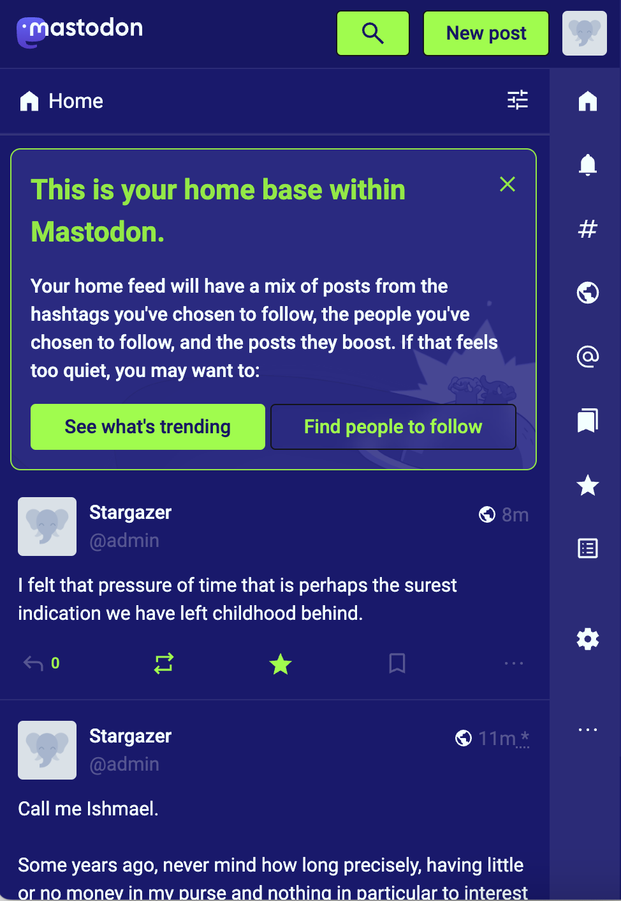
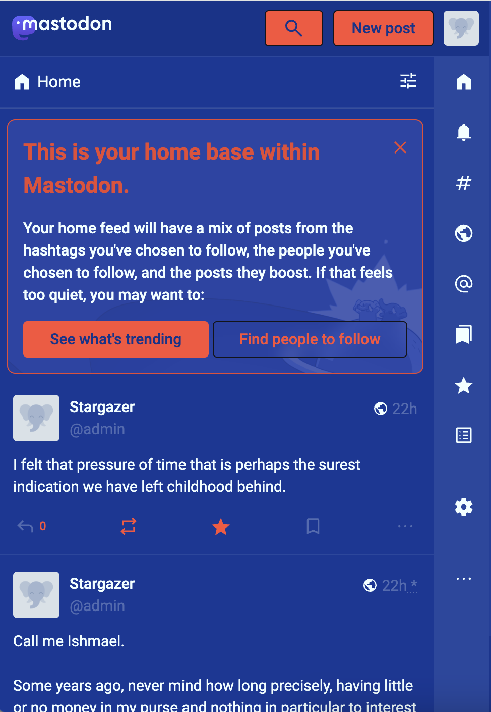
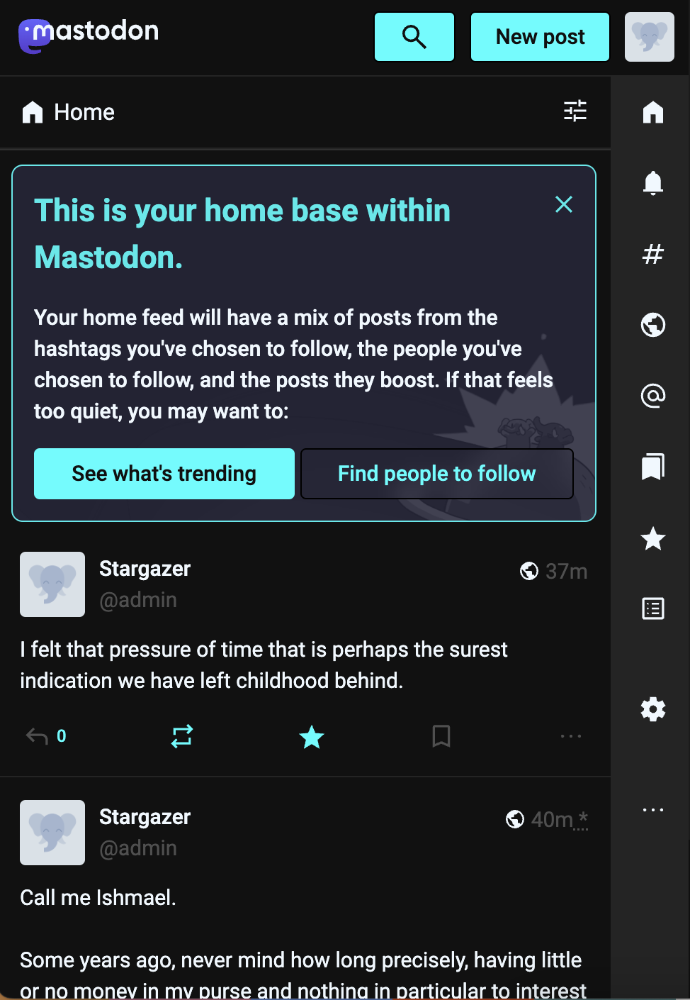

# mast

Mastodon Theme Generator

Live version: [mnvr.github.io/mast](https://mnvr.github.io/mast/)

This is not a solid solution, it is just a prototype, and will likely not
produce CSS that works in all cases. If you do use it, please try to ensure that
there is good contrast between text and background.

### Examples

| [Midnight Chartreuse](https://mnvr.github.io/mast/#base=midnightblue&primary=azure&secondary=darkgrey&highlight=chartreuse&shadow=%23131419) | [Erich Mrozek](https://mnvr.github.io/mast/#base=rgb%2819%2C56%2C153%29&primary=azure&secondary=darkgrey&highlight=rgb%28254%2C78%2C55%29&shadow=%23131419) | [Night](https://mnvr.github.io/mast/#base=%23111&primary=aliceblue&secondary=lightcyan&highlight=cyan&shadow=black) |
| ---- | ---- | ---- |
|  |  |  |

## Previewing

Mastodon's CSS is complex. And there is a lot of it. 14000 lines (and that's
just with the default theme).

So the full impact of the CSS generated by us can only really be seen in a real
context. That said, you might want to preview it on a test instance.

An easy(-ish) way to set up a test instance is to use a GitHub Codespace, using
the instructions in [Mastodon's
README](https://github.com/mastodon/mastodon#github-codespaces). This'll create
a new VM running a Mastodon instance without needing to install anything on your
computer.

> As of writing, the README instructions didn't work - the codespace launched in
> recovery mode. To fix this, I had to edit `.devcontainer/post-create.sh`
> (within the codespace itself) and comment out the following line at the end of
> the file:
>
> ```sh
> RAILS_ENV=test ./bin/rails assets:precompile
> ```
>
> If you edit the file, VS Code's clippy will helpfully ask you if you wish to
> restart with the changes. Say yes, and that should fix the issue.

To login to your test instance, use

* Email `admin@<domain>`, where `<domain>` is where your codespace is running.
  So this'll be something like `admin@xxx-3000.app.github.dev`.
* Password `mastodonadmin`

### Using Bitnami Mastodon Images

GH Codespaces are wonderful for quick testing, but if you want a longer running
dev instance where other folks can also preview your theme before you apply it
to your main instance, it might be better to create a cloud VM.

The easiest way I've found is using the [Docker image provided by
Bitnami](https://hub.docker.com/r/bitnami/mastodon/) (Thanks!).

1. Create a VM on a VPS somewhere. [Here's a list of free cloud
   providers](https://github.com/cloudcommunity/Cloud-Free-Tier-Comparison).

2. For example, I used Azure, since they already have a "Bitnami package for
   Mastodon". I created a VM using this, and within the VM settings, created a
   DNS hostname for the public IP of the VM. Finally, I used their Cloud CLI to
   SSH into the VM.

3. The site will already be available on the hostname, but won't be serving
   Mastodon, instead it'll list the two steps we need to do further.

       sudo /opt/bitnami/configure_app_domain --domain <hostname>
       sudo /opt/bitnami/bncert-tool --domains <hostname>

4. That's it. Mastodon will be available on hostname, nicely served over HTTPS
   thanks to the nice folks over at Let's Encrypt. To obtain the login (admin)
   credentials, do

       sudo cat /home/bitnami/bitnami_credentials


## Running the generator locally

The site is a [single† HTML file](docs/index.html), hosted on GitHub pages. To
run locally, you can clone the repository and open the HTML file in your
browser.

<small>† for convenience of bugfixes, the [template CSS](docs/template.css) is
in a separate file, but you can hardcode its contents in the HTML too.</small>

A bit more convenient might be using a live reload tool. I used [Five
server](https://github.com/yandeu/five-server-vscode) when making this.

### Tips

The browser's CSS inspector is our friend. And under the sources tab we can find
a `default-xxx.chunk.css` - this is what our `template.css` is derived from.

Mastodon itself generates the CSS from SASS files, which can be found in the
Mastodon source under
[app/javascript/styles/](https://github.com/mastodon/mastodon/tree/main/app/javascript/styles).

You might also find this [CSS color list](https://mrmr.io/css-colors) handy.

### Automatic dark mode

One thing dearly missing from Mastodon is the ability for it to automatically
switch between dark and light themes. I, like many other folks, have our
machines set to automatically switch between light and dark themes at day/night.
So any site that doesn't respect the system theme stands out like a sore thumb
and is not great for the eyes.

One of my original motivations to make this theme generator was to allow
automatic theme switching. The current version of the template that it uses does
not do that, but the scaffolding is set up for it. So say you have figured out
the colors for both your light (default) and dark modes. Then, just insert the
following section at the top of the generated CSS:

```css
/* Add this to Server settings > Appearance > Custom CSS */

:root {
    --mast-in-base: ...
    ... /* this is the part that the theme generator creates ...*/
}

/** Add this section */
@media (prefers-color-scheme: dark) {
    :root {
        --mast-in-base: ...
        ... /* add the 5 dark color definitions here */
    }
}
```

That's it. The rest of the generated CSS remains unchanged.
